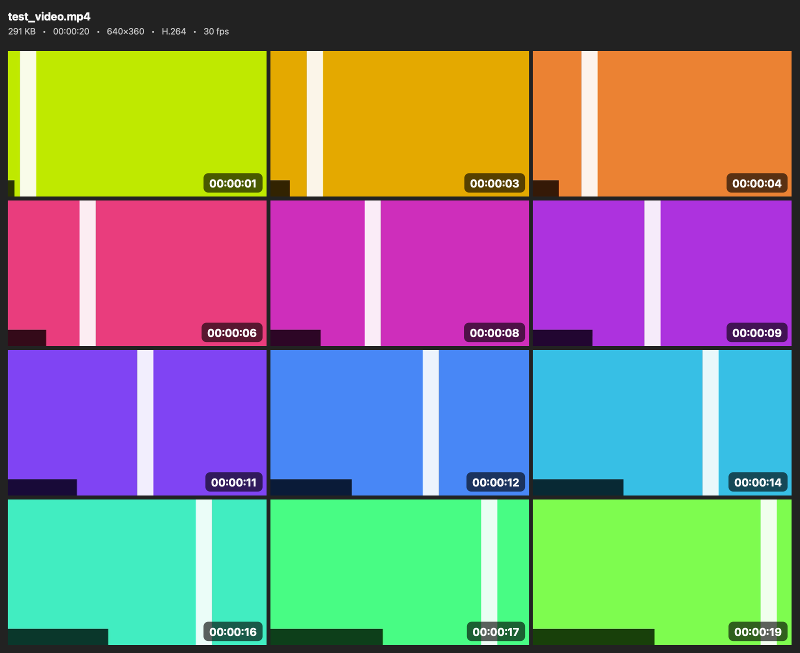

# Screenlist Creator

A native macOS app that creates **screenlists** (thumbnail contact sheets) from video
files — a grid of evenly spaced frames with an optional info header and per-frame
timestamps, exported as a single image.



*Sample output (4×3 grid, dark theme, header and timestamps on) generated from a synthetic test video.*

## Features

- **Drag & drop** one or more videos into the queue (or ⌘O / "Add Videos", or drop
  them on the Dock icon). Batch processing with per-video progress.
- **Wide format support**: AVI, MKV, WebM, WMV, FLV, MPEG and more besides the
  MP4/MOV family — see [Video formats](#video-formats).
- **Grid**: 1–12 rows × 1–10 columns, sheet width 640–6144 px, adjustable cell
  spacing and outer margin.
- **Appearance**: dark or light sheet theme; optional header with file name, size,
  duration, resolution, codec and frame rate; optional timestamp badge on each
  frame in any corner.
- **Capture range**: skip a percentage of the intro/outro (default 2 %) so credits
  and black lead-ins don't waste cells; frames are sampled evenly across the rest.
- **Output**: JPEG / PNG / HEIC / TIFF, quality slider for lossy formats, save next
  to the video or into a chosen folder, file-name template with `{name}`, `{date}`,
  `{time}`, `{rows}`, `{cols}` tokens, and a keep-both/overwrite collision policy.
- **Preview** button renders a reduced-size sheet without writing any file.
- Settings persist between launches.

## Video formats

Frames are read through one of two decoders, chosen per file:

| Decoder | Handles | Needs |
| --- | --- | --- |
| AVFoundation | `.mp4` `.m4v` `.mov` `.qt` `.3gp` `.3g2` `.ts` `.m2ts` `.mts` `.m2t` `.mpg` `.mpeg` `.mpe` `.m1v` `.m2v` `.dv` | nothing — built into macOS |
| FFmpeg | `.avi` `.mkv` `.webm` `.wmv` `.asf` `.flv` `.f4v` `.divx` `.ogv` `.ogm` `.rm` `.rmvb` `.mxf` `.vob` `.mod` `.tod` `.mpv` `.mk3d` `.nut` `.gxf` `.wtv` `.vro` `.y4m` `.amv` | `ffmpeg` + `ffprobe` on the machine |

Every file is tried with AVFoundation first, because it is faster and hardware
accelerated. A file it cannot open — or opens but cannot decode, which is common
for AVI and Matroska carrying codecs macOS has no decoder for — is handed to
FFmpeg. Individual frames that fail on the AVFoundation path also fall back to
FFmpeg, so a partially damaged file still fills its grid.

FFmpeg is **optional**: without it the app behaves as it always did and the extra
formats report a clear error instead of failing silently. To enable them:

```bash
brew install ffmpeg
```

The app looks in `/opt/homebrew/bin`, `/usr/local/bin`, `/opt/local/bin`, `/sw/bin`,
`/usr/bin`, `$PATH`, and `Contents/Helpers` inside its own bundle — a GUI app
launched from Finder does not inherit a shell `PATH`, so the well-known locations
are checked directly. If your copy lives elsewhere, point at it under **Decoding**
in the settings pane. Dropping `ffmpeg` and `ffprobe` into `Contents/Helpers`
makes a self-contained bundle; that location wins over anything installed on the
machine.

## Building

Requires macOS 14+ and the Xcode Command Line Tools (full Xcode works too).

```bash
./scripts/build-app.sh
```

This compiles with `swiftc`, renders the app icon, assembles and ad-hoc signs
`dist/Screenlist Creator.app`. Copy it to `/Applications` if you like.

> The script deliberately avoids SwiftPM/xcodebuild: it compiles the sources
> directly, and if the newest installed SDK requires Xcode-only SwiftUI macro
> plugins it automatically falls back to the newest usable SDK
> (override with `SDK=/path/to/MacOSX.sdk ./scripts/build-app.sh`).

## Headless CLI

The binary inside the bundle also works headlessly, which is handy for scripting
and testing:

```bash
"dist/Screenlist Creator.app/Contents/MacOS/ScreenlistCreator" --cli video.mkv \
    [--out folder] [--rows N] [--cols N] [--format jpeg|png|heic|tiff] [--width px] \
    [--ffmpeg /path/to/ffmpeg]
```

It reports which decoder was used, e.g. `… 640×360, MPEG-4 (XVID), 4.4 MB [FFmpeg]`.
`--cli --formats` prints the format table above along with the resolved FFmpeg path.

## Project layout

| Path | Purpose |
| --- | --- |
| `Sources/ScreenlistCreator/ScreenlistEngine.swift` | Frame extraction dispatch + sheet composition (CoreGraphics) + export (ImageIO) |
| `Sources/ScreenlistCreator/VideoMetadata.swift` | Duration/resolution/codec/fps/size loading, backend selection |
| `Sources/ScreenlistCreator/VideoFormats.swift` | Supported container list, `MediaBackend` |
| `Sources/ScreenlistCreator/AVFoundationBackend.swift` | Native frame extraction + decodability probe |
| `Sources/ScreenlistCreator/FFmpegBackend.swift` | `ffprobe` metadata + `ffmpeg` frame extraction |
| `Sources/ScreenlistCreator/FFmpegTool.swift` | Locates `ffmpeg`/`ffprobe`, reads its version |
| `Sources/ScreenlistCreator/ProcessRunner.swift` | Child-process helper (pipe draining, cancellation, timeout) |
| `Sources/ScreenlistCreator/TextRenderer.swift` | CoreText line drawing (AppKit-free, background-safe) |
| `Sources/ScreenlistCreator/Settings.swift` | Settings model, persisted to `UserDefaults` |
| `Sources/ScreenlistCreator/AppViewModel.swift` | Video queue, generation orchestration |
| `Sources/ScreenlistCreator/ContentView.swift` | SwiftUI interface |
| `Sources/ScreenlistCreator/Main.swift` | App entry, Dock-drop delegate |
| `Sources/ScreenlistCreator/CLIRunner.swift` | Headless `--cli` mode |
| `scripts/build-app.sh` | Build + bundle + sign |
| `scripts/make_icon.swift` | Renders the app icon programmatically |
